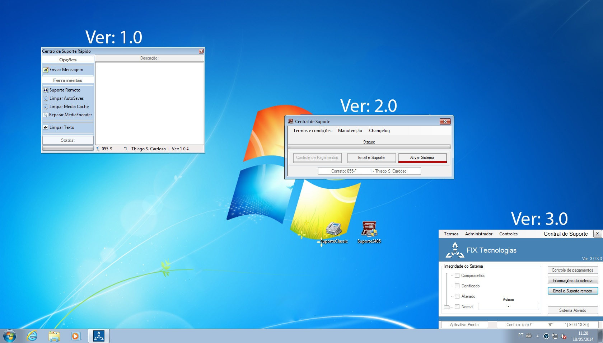
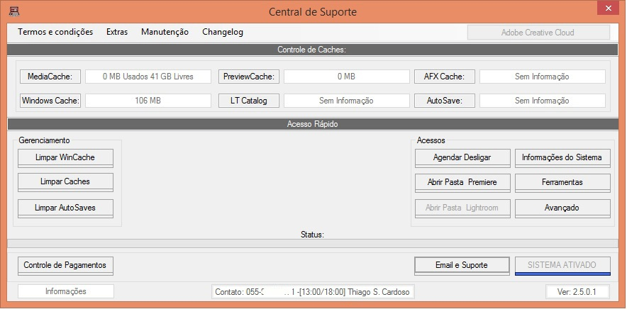

# CentralFixApp

This is a private project, created as a main support and easy to manange complicated file handling for professional software, as Adobe.
also, it is included some simple scans for common usb flashdrive virus and rogue/adware on the system.

It also automate the process to start the remote support (teamviewer), since most clients dont know how to proceed.

First image: the concept - started with a simple idea for a common problem
and it evolved.

sec pic: the version 2, with its Professional Adobe fast control main window.

## 🖼️ Application Screenshots

