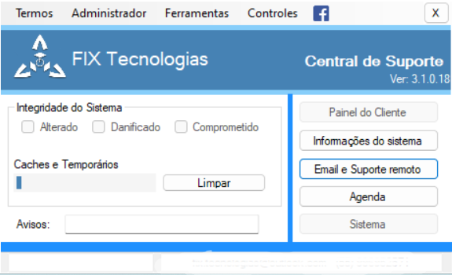
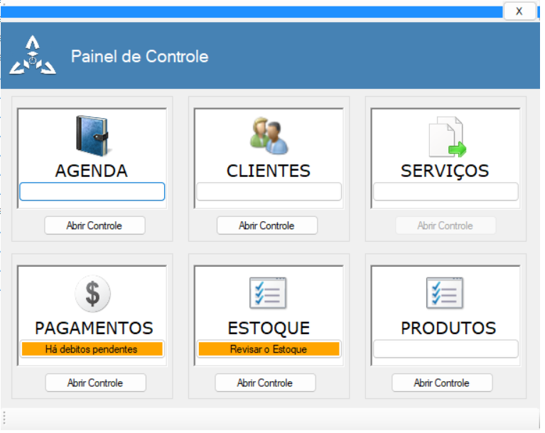

# CentralFixApp

This is a private project created to simplify and streamline complex file management tasks for professional software such as Adobe applications.

It also includes basic system scans to detect common USB flash drive malware, as well as rogue software and adware.

In addition, the application automates the process of launching remote support through TeamViewer, making it easier for clients who are unfamiliar with the setup process.

**First image:** The original concept. It started as a simple solution to a common problem and gradually evolved into a more comprehensive tool.

**Second image:** Version 2, featuring a dedicated control panel for fast management of Adobe-related tasks.

**Remaining images:** Version 3 and later improvements.

## 🖼️ Application Screenshots

